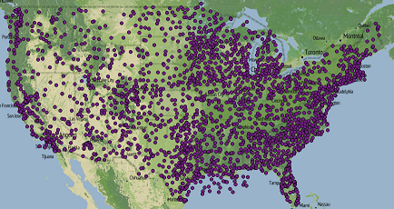
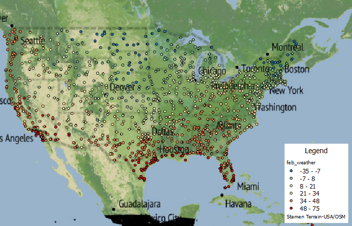
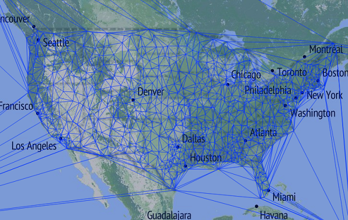
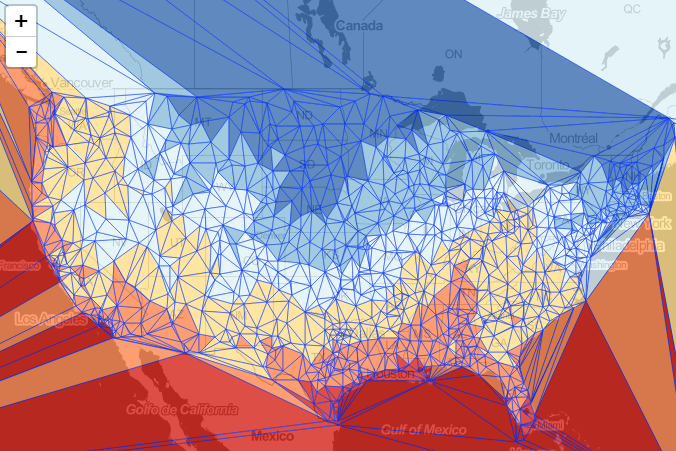
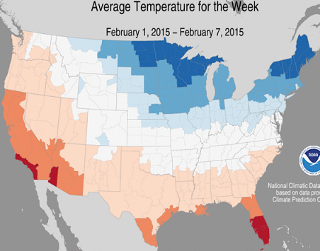

## Visualizing February 2015 Weather Data ##

February was a particularly cold month across most of the United States.  For us here in Oregon, we've been enjoying warm weather... but most further east have had record lows and heavy snow.  I've been interested in finding new ways to visualize this data.  I'll be using [NOAA's quality controlled logical climatological data](http://cdo.ncdc.noaa.gov/qclcd/QCLCD?prior=N) to load weather station data across the US into a Postgres database.  From there I hope to generate TIN's using [turf.js](http://turfjs.org/).

The initial hurdle is getting the stations and readings into our database.  Our file from NOAA has the following pipe delineated headers:
	
	WBAN|WMO|CallSign|ClimateDivisionCode|ClimateDivisionStateCode|ClimateDivisionStationCode|Name|State|Location|Latitude|Longitude|GroundHeight|StationHeight|Barometer|TimeZone

I don't need all of these, just the WBAN (unique id of station), State, Location, Latitude and Longitude.  Let's create the initial table:

Enable postgis on database:

	CREATE EXTENSION postgis;

Create table for stations:

	CREATE TABLE weather_stations (
        WBAN integer,
        State char(2),
        Location varchar(150),
        Latitude decimal(9,6) NOT NULL,
        Longitude decimal(9,6) NOT NULL
    );

I deleted the erroneous columns from the original file for easy import.  From psql command line, I ran the [following command](http://stackoverflow.com/questions/2987433/how-to-import-csv-file-data-into-a-postgres-table) to bring the stations into postgres:

    \copy weather_stations FROM 'csv location' DELIMITER '|' CSV HEADER;

Add an auto incremented primary key:

    ALTER TABLE weather_stations ADD COLUMN id SERIAL PRIMARY KEY;

[Add geometry column](http://postgis.net/docs/AddGeometryColumn.html):

    SELECT AddGeometryColumn ('public', 'weather_stations', 'geom', 4326, 'POINT', 2);

Lastly, let's create actual points from our Latitude and Longitude fields:

    UPDATE weather_stations SET
    geom = ST_SetSRID(ST_MakePoint(Longitude, Latitude),4326)

If we look at our data in QGIS, we see this now!

Now that the stations are in our database, we need to import our weather station readings.  The process will be similar to what we accomplished getting the stations in.  The readings are comma delineated and contain information or daily recordings.  The initial format looks like:

    WBAN,YearMonthDay,Tmax,TmaxFlag,Tmin,TminFlag,Tavg,TavgFlag,Depart,DepartFlag,DewPoint,DewPointFlag,WetBulb,WetBulbFlag,Heat,HeatFlag,Cool,CoolFlag,Sunrise,SunriseFlag,Sunset,SunsetFlag,CodeSum,CodeSumFlag,Depth,DepthFlag,Water1,Water1Flag,SnowFall,SnowFallFlag,PrecipTotal,PrecipTotalFlag,StnPressure,StnPressureFlag,SeaLevel,SeaLevelFlag,ResultSpeed,ResultSpeedFlag,ResultDir,ResultDirFlag,AvgSpeed,AvgSpeedFlag,Max5Speed,Max5SpeedFlag,Max5Dir,Max5DirFlag,Max2Speed,Max2SpeedFlag,Max2Dir,Max2DirFlag

Obviously, we are only interested in the WBAN (station id), YearMonthDay, Tmax, Tmin and Tavg.  These will give us the ability to map low, high and average daily temperatures.  I went ahead and removed the other columns from the initial dataset.  Let's create the table in postgres.  I used varchar for the temperatures because of some string M values which equal missing... we can filter these out later.

    CREATE TABLE readings_feb (
        WBAN integer,
        YearMonthDay integer NOT NULL,
        Tmax varchar(5),
        Tmin varchar(5),
        Tavg varchar(5)
    );

Import csv file:

    \copy readings_feb FROM 'D:\TannerGeo\WeatherTinTurf\data_raw\QCLCD201502\201502daily.csv' DELIMITER ',' CSV HEADER;

Finally, add a primary key:

    ALTER TABLE readings_feb ADD COLUMN id SERIAL PRIMARY KEY;

To visualize the data in QGIS, I created a special view with just the low temp.  Notice we've casted the [tmin to int](http://dba.stackexchange.com/questions/3429/how-can-i-convert-from-double-precision-to-bigint-with-postgresql):

    CREATE VIEW feb_weather AS
    SELECT a.id, a.wban, a.yearmonthday, a.tmin::int, b.state, b.location, b.geom
    FROM readings_feb a
    LEFT JOIN weather_stations b
    ON a.wban = b.wban

By adding a filter for just February 1st in QGIS and symbolizing by temperature, the cold weather trends become apparent.  The mid-west and northeast have bone chilling lows while the west coast and southern US had relatively high temperatures.

To incorporate the data into our mapping application, it's preferable that we work with a data format suited to our needs.  I'll be using [geojson](http://geojson.org/), mostly because this format will work best with [turf.js](http://turfjs.org/static/docs/global.html#GeoJSON).  We could [build a query](http://www.postgresonline.com/journal/archives/267-Creating-GeoJSON-Feature-Collections-with-JSON-and-PostGIS-functions.html) to generate this straight from postgres, but I'd prefer to just use [pgsql2shp](http://www.bostongis.com/pgsql2shp_shp2pgsql_quickguide.bqg) and then [GDAL's ogr2ogr](http://www.gdal.org/ogr2ogr.html) to convert to geojson.

Create shapefile using pgsql command line tools:

    pgsql2shp -f weather_02012015 -h localhost -p 5432 -u username -P password geodata "SELECT * FROM feb_weather WHERE yearmonthday = 20150201";

Convert to GeoJSON using [GDAL](http://www.gisinternals.com/query.html?content=filelist&file=release-1800-x64-gdal-1-11-1-mapserver-6-4-1.zip):

    ogr2ogr -f GeoJSON ../geojson/02012015.geojson 02012015.shp

Our output file is 287KB could probably be smaller since we don't necessarily need all of the fields to make the TIN map.

The only dependencies I know of that we need to create the map are turf.js and leaflet.  I chose to use bower to install these dependencies:

    bower install turf
    bower install leaflet

For bringing in the geojson, I'm just going to assign the object to a variable and place it in a seperate .js file.   For future reference though, [calvinmetcalf](https://github.com/calvinmetcalf) has created a great helper for leaflet called the [leaflet-ajax](https://github.com/calvinmetcalf/leaflet-ajax) library for working with geojson files.

We now have a .js file called 02012015.js with the geojson assigned to the variable feb01.

    var feb01 = {
        type": "FeatureCollection",
		"crs": { "type": "name", "properties": { "name": "urn:ogc:def:crs:OGC:1.3:CRS84" } },
		...

I want to first make sure I can create the TIN's.  To test, I use turf.js to build and add them to the map with no fill.  By passing in TMIN, turf generates Z values that we can then use to generate our fill colors.

	var tin = turf.tin(feb01, 'TMIN');
	var geojson = L.geoJson(tin, {
		style : {
			weight : 1
		}
	});
	geojson.addTo(map);

Our result is a visually interesting graphic:

For our fill colors, I'm going to use a library I built called [classybrew](https://github.com/tannerjt/classybrew).  It uses the natural breaks (Jenks) method of statistical classification and applies colors based on Cynthia Brewers color palettes.  I added a new diverging color palette for red-yellow-blue.  This should give us a good thematic perspective of color.

To stylize the map, we first need to initialize and setup or statistical breaks and color palette based on our minimum temperature values.

    // create classification for colors
	var brew = new classyBrew();
	var values = []; // tmin values
	for( var i = 0; i < feb01.features.length; i++) {
		values.push(feb01.features[i].properties['TMIN']);
	}
	brew.setSeries(values);
	brew.setNumClasses(6);
	brew.classify();
	brew.setColorCode("BuYlRd");

Now that we have the classybrew object setup, we can request a color code based on a provided value with <code>getColorInRange(value)</code>.  We'll use this function to return a color based on the average of minimum temperature from each station that makes up our triangles.  This can be done during instantiation of our geojson layer.  First, however we need to create our TIN from our points using <code>turf.tin(geojson, z value)</code>.

	var tin = turf.tin(feb01, 'TMIN');
	var geojson = L.geoJson(tin, {
		style : function (f) {
			return {
				weight : 1,
				fillColor : (function () {
					return brew.getColorInRange((f.properties.a + f.properties.b + f.properties.c) / 3.0, true);
				}()),
				fillOpacity : 0.85
			}
		}
	});
	geojson.addTo(map);

Our result is rather captivating:

If we look at a map from the NOAA National Climatic Data Center, we can see our map aligns with their model:

I think this is all I was looking to do for now.  The output is visually interesting and shows how powerful turf.js is with very little code.  I'd like to take this further and make a more in depth application with the data and turf.js.  Look for more to come in the future, and thanks for following along!
